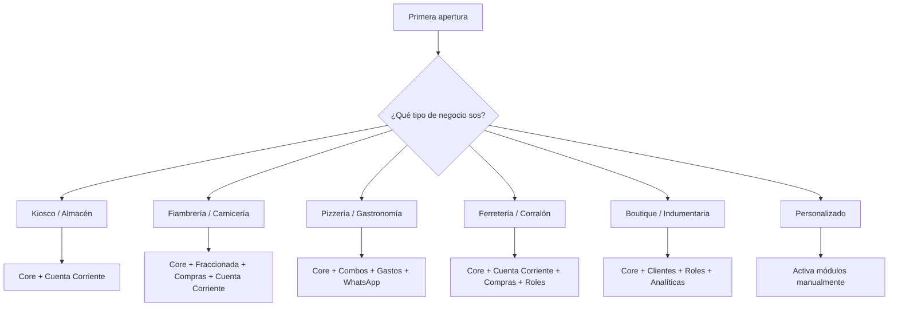

# Sistema Modular — ClinPOS

Documento vivo de arquitectura y producto. Actualizado con foco en el mercado argentino real.

---

## 1. El Núcleo Base (Core) — Innegociable

Todo lo que siempre está activo. Sin esto, no hay sistema.

### Entidades del Core
| Entidad | Descripción |
| :--- | :--- |
| `Product` | Catálogo de productos con SKU, precio de compra, precio de venta |
| `Sale` + `SaleItem` | Cabecera y detalle de cada venta. Precio congelado al momento de la venta |
| `CashRegister` + `CashMovement` | Apertura/cierre de caja y todos sus movimientos |
| `Setting` | Configuración general del sistema |

### Reglas de Negocio del Core

1. **Venta mínima:** Al menos 1 `SaleItem` con producto y cantidad válida.
2. **Precio histórico congelado:** El precio se guarda en `SaleItem` en el momento del cobro. Cambios posteriores al catálogo no afectan ventas pasadas.
3. **Caja abierta obligatoria (regla global):** La caja debe estar en estado `OPEN` para registrar **cualquier movimiento de dinero**: ventas, gastos, retiros o depósitos. Aplica a todos los módulos que generan `CashMovement`, sin excepción.
   - Compras y Proveedores quedan fuera de esta regla porque su impacto es sobre stock, no sobre efectivo. Si en el futuro se registra el pago de una compra como egreso de caja, pasa a estar sujeto.
   - Implicación técnica: todo endpoint que cree un `CashMovement` debe verificar primero que exista un `CashRegister` con `status: 'OPEN'`.
4. **Stock se descuenta al confirmar:** Nunca antes. Evita fantasmas de stock por ventas abandonadas.
5. **Alertas de stock incluidas:** El sistema avisa cuando un producto cae por debajo del stock mínimo configurado. No es módulo separado — un POS sin alertas de stock pierde demasiado valor básico.
6. **Dashboard simple incluido:** Cuánto vendí hoy, cuánto gané, qué productos tienen stock crítico. Solo eso. Sin gráficos.

---

## 2. Módulos Pluggables — Orden de Prioridad Argentina

Los módulos están ordenados por **prioridad de desarrollo y valor percibido** en el mercado argentino real. Los primeros cinco resuelven problemas por los que un comercio paga todos los meses. Los últimos son valor agregado.

---

### Módulo 1 — Cuenta Corriente / Fiado ⭐

> **Por qué primero:** Kioscos, ferreterías, fiambrerías, distribuidoras, corralones — todos venden fiado. Resuelve un problema de plata real y cotidiano.

- **Depende de:** Clientes (Módulo 3)
- **Afecta a:** Nueva entidad `AccountBalance`, `AccountPayment`
- **Funciones:**
  - Saldo deudor por cliente
  - Pagos parciales o totales contra la deuda
  - Historial completo de movimientos de cuenta
  - Vencimientos y fechas límite de pago
  - Alertas de deuda vencida
  - Al registrar una venta "en cuenta": no genera `CashMovement` inmediato; genera entrada en `AccountBalance`
- **Reglas:**
  - Solo se puede usar si el módulo Clientes está activo (necesita un `clientId` válido).
  - Al desactivar: las deudas abiertas quedan visibles en modo lectura pero no se pueden crear nuevas.
  - *Caso borde:* No se puede desactivar si hay cuentas con saldo deudor abierto — forzar a cerrarlas o migrarlas primero.

---

### Módulo 2 — Facturación Electrónica (ARCA/ex-AFIP) ⭐

> **Por qué segundo:** Muchos negocios arrancan sin factura, pero cuando crecen es lo primero que necesitan. Es una razón real y recurrente para pagar suscripción.

- **Depende de:** Core, Clientes (para el receptor de la factura)
- **Afecta a:** Nueva entidad `Invoice`, `InvoiceItem`; campo `invoiceId` en `Sale`
- **Funciones:**
  - Factura A (responsable inscripto)
  - Factura B (consumidor final)
  - Nota de Crédito
  - Generación de CAE vía servicio web ARCA
  - Impresión de comprobante AFIP
  - Numeración correlativa automática
- **Reglas:**
  - Requiere configuración previa: CUIT, punto de venta ARCA, certificado digital.
  - Factura se genera opcionalmente al cerrar una venta (no bloquea el flujo si el servicio ARCA no responde — guarda en cola de reintento).
  - Al desactivar: las facturas ya emitidas quedan accesibles en modo lectura; no se pueden emitir nuevas.

---

### Módulo 3 — Clientes (CRM)

- **Depende de:** Nada (independiente).
- **Afecta a:** `Sale.clientId` (opcional).
- **Funciones:** Registro de contacto, historial de compras, búsqueda en vivo durante la venta.
- **Reglas:**
  - Sin módulo activo: `clientId` queda `null` en todas las ventas. Sin fallback genérico (no hay integridad referencial obligatoria acá).
  - Ventas hechas sin cliente mientras el módulo estuvo inactivo quedan huérfanas definitivamente — no hay asignación retroactiva.
  - Al desactivar: datos intactos, interfaz oculta.

---

### Módulo 4 — Roles y Permisos (Multiusuario)

> **Por qué prioritario:** Muchos comercios tienen dueño, cajero y encargado. El vendedor registra ventas pero no debería poder ver rentabilidad ni borrar productos.

- **Depende de:** Nada (independiente).
- **Afecta a:** Nueva entidad `User`, `Role`; control de acceso a rutas y acciones de la API.
- **Perfiles base:**
  | Rol | Puede hacer |
  | :--- | :--- |
  | **Administrador** | Todo. Configuración, módulos, precios, historial completo. |
  | **Supervisor** | Ventas, caja, ver reportes. No puede cambiar precios ni configuración. |
  | **Cajero** | Solo nueva venta y apertura/cierre de caja. No ve historial ni analytics. |
- **Reglas:**
  - Sin módulo activo: un único usuario con acceso total (comportamiento actual).
  - Al activar: el primer usuario existente se convierte automáticamente en Administrador.
  - Al desactivar: todos los usuarios recuperan acceso total.

---

### Módulo 5 — Mercado Pago

> **Por qué:** En Argentina es prácticamente obligatorio. No como método de pago simple (QR ya está), sino como integración con conciliación automática.

- **Depende de:** Core.
- **Afecta a:** `Sale.paymentType`, `CashMovement`; nueva entidad `MPTransaction`.
- **Funciones:**
  - Cobro por QR con confirmación automática (webhook MP)
  - Link de pago por WhatsApp o mensaje
  - Conciliación automática: cuando MP confirma el pago, el sistema lo registra sin intervención manual
  - Diferenciación de comisión MP en el desglose del cierre de caja
- **Reglas:**
  - Requiere configuración de credenciales MP (Access Token, Public Key).
  - Si el webhook no llega: el cajero puede confirmar el pago manualmente como fallback.
  - Al desactivar: los pagos MP ya registrados quedan en el historial. El QR manual sigue disponible en el Core como método de pago sin integración.

---

### Módulo 6 — Compras y Proveedores

- **Depende de:** Nada (interactúa con stock del Core).
- **Afecta a:** `Purchase`, `PurchaseItem`, `Supplier`. Actualiza `Product.quantityStock` al recibir.
- **Reglas:**
  - Sin módulo: reposición de stock es manual (editar producto directo).
  - *Caso borde:* No se puede desactivar si hay compras en estado `PENDING` u `ORDERED`. Forzar a completarlas o cancelarlas primero.
  - Datos históricos intactos al desactivar.

---

### Módulo 7 — WhatsApp

> **Por qué:** Argentina vive en WhatsApp. Enviar un comprobante, un aviso de deuda o un pedido a un proveedor por WhatsApp es valor inmediato y tangible.

- **Depende de:** Core; Clientes para envíos a clientes; Cuenta Corriente para avisos de deuda; Proveedores para pedidos.
- **Funciones:**
  - Enviar comprobante de venta al cliente vía WA
  - Enviar aviso de deuda pendiente (integrado con Cuenta Corriente)
  - Enviar pedido de compra al proveedor (integrado con Compras)
  - Enviar promoción a lista de contactos (integrado con Clientes)
- **Implementación:** Usar la API oficial de WhatsApp Business o deep link `wa.me/?text=...` (sin costo, sin API key) para el caso básico.

---

### Módulo 8 — Venta Fraccionada (Peso / Granel / Volumen)

- **Depende de:** Core (`Product`).
- **Afecta a:** `Product.unitType` (KG, L, M, UN) y validación decimal en `SaleItem.quantity`.
- **Reglas:**
  - Es un ajuste por producto individual, no global. Habilita la opción de marcar productos como fraccionables.
  - Sin módulo: toda cantidad es número entero. Oculta campos de unidad de medida y modales de peso.
  - *Caso borde al desactivar:* Alertar si hay productos con stock decimal activo para que el usuario haga ajuste manual a enteros.

---

### Módulo 9 — Combos y Promociones

- **Depende de:** Core (`Product`, `SaleItem`).
- **Afecta a:** `Combo`, `Promotion`, `DiscountCode`; motor de cálculo del carrito.
- **Reglas:**
  - Sin módulo: carrito calcula solo `cantidad × precio`. Sin motor de descuentos.
  - Combos y promociones definidos se preservan al desactivar; se reactivan solos si se vuelve a encender.
  - *Integridad:* si un producto de un combo activo se elimina, el combo se marca automáticamente como inválido.

---

### Módulo 10 — Gastos Operativos

- **Depende de:** Core (`CashMovement`).
- **Afecta a:** `Expense`.
- **Reglas:**
  - Sin módulo: el cierre de caja no muestra línea de gastos.
  - Gastos históricos siguen contando en arqueos de caja pasados.
  - Registrar un gasto requiere caja abierta (regla global del Core).

---

### Módulo 11 — Analíticas Avanzadas

> **Reencuadre:** La mayoría de los comercios chicos no abre gráficos. El dashboard básico (cuánto vendí, qué falta reponer) va en el Core. Las analíticas avanzadas son para negocios que ya quieren optimizar.

- **Depende de:** Core (solo lectura).
- **Afecta a:** Solo UI. Cero escritura en base de datos.
- **Funciones avanzadas:**
  - Top productos por volumen y por rentabilidad
  - Margen por categoría
  - Comparación semana/mes anterior
  - Tendencia de ventas
  - Métodos de pago más usados
- **Reglas:** El más simple — al desactivar solo desaparecen los gráficos. Sin casos borde de integridad.

---

## 3. Perfiles de Negocio (Preajustes)

Seleccionar un perfil activa automáticamente el set de módulos óptimo para ese rubro. Los preajustes son un punto de partida — el usuario puede personalizarlos libremente después.



### Verticales específicas (a desarrollar como extensión futura)

| Vertical | Módulos extra | Funciones específicas |
| :--- | :--- | :--- |
| **Carnicería** | Fraccionada | Costeo por kilo, etiquetas de balanza |
| **Indumentaria** | Clientes, Analíticas | Talles, colores, variantes de producto |
| **Ferretería** | Cuenta Corriente, Compras | Código de barras, stock por línea |
| **Gastronomía** | Combos, Gastos | Comanda de cocina, impresora secundaria |

---

## 4. Planes de Precio (Modelo Argentina)

Tres planes fijos. Fácil de comunicar. El usuario piensa "¿cuánto me sale?" no "¿cuál módulo activo?".

```
┌────────────────┬─────────────────────────────────────────────────────────┐
│   STARTER      │  USD 8/mes                                              │
│                │  Core completo: ventas, caja, productos, stock, alertas │
│                │  Dashboard simple incluido                              │
│                │  Ideal: kiosco simple, puesto de feria, emprendimiento  │
├────────────────┼─────────────────────────────────────────────────────────┤
│   COMERCIO     │  USD 20/mes                                             │
│                │  Todo Starter +                                         │
│                │  Clientes · Cuenta Corriente · Compras/Proveedores      │
│                │  Gastos · Roles y Permisos                              │
│                │  Ideal: almacén, ferretería, fiambrería, kiosco grande  │
├────────────────┼─────────────────────────────────────────────────────────┤
│   PRO          │  USD 32/mes                                             │
│                │  Todo Comercio +                                        │
│                │  Facturación Electrónica · Mercado Pago                 │
│                │  WhatsApp · Analíticas Avanzadas                        │
│                │  Combos/Promociones · Venta Fraccionada                 │
│                │  Ideal: gastronomía, mayorista, comercio en crecimiento │
└────────────────┴─────────────────────────────────────────────────────────┘
```

> **Regla de upsell:** El usuario ve exactamente qué módulos tiene desactivados en su plan y cuánto le costaría subir al siguiente. El botón de upgrade está en la misma pantalla de módulos.

### Precios individuales (solo para clientes que quieren à la carte)

| Módulo | USD/mes individual |
| :--- | :---: |
| Cuenta Corriente / Fiado | USD 6 |
| Facturación Electrónica | USD 8 |
| Mercado Pago | USD 5 |
| Clientes (CRM) | USD 3 |
| Roles y Permisos | USD 4 |
| Compras y Proveedores | USD 5 |
| WhatsApp | USD 4 |
| Venta Fraccionada | USD 4 |
| Combos y Promociones | USD 5 |
| Gastos Operativos | USD 2 |
| Analíticas Avanzadas | USD 4 |

---

## 5. Roadmap de Desarrollo — Orden Recomendado

Priorizado por valor percibido en el mercado argentino. Los primeros cinco son los motivos reales por los que un comercio paga.

| # | Módulo | Motivo |
| :--- | :--- | :--- |
| 1 | **Cuenta Corriente** | Problema de plata. Resuelve el fiado que hoy se anota en un cuaderno. |
| 2 | **Facturación Electrónica** | Razón real de suscripción. Crecimiento natural del negocio. |
| 3 | **Mercado Pago** | Prácticamente obligatorio en Argentina. Genera confianza. |
| 4 | **Roles y Permisos** | Muchos locales tienen más de un empleado. |
| 5 | **Compras y Proveedores** | Completa el ciclo de reposición de stock. |
| 6 | **WhatsApp** | Valor inmediato y percibido. Diferenciador frente a la competencia. |
| 7 | **Venta Fraccionada** | Nicho específico pero que paga bien (fiambrerías, etc.). |
| 8 | **Combos y Promociones** | Valor real para gastronomía y mayoristas. |
| 9 | **Analíticas Avanzadas** | Para negocios más maduros. No es motivo de compra inicial. |

---

## 6. Posicionamiento de Mercado

**No competimos contra:** Maxirest, Xubio, Colppy, Bind ERP — ya están instalados en segmentos más grandes.

**Competimos contra:** Excel, cuaderno, WhatsApp, "lo tengo de memoria".

**Nuestro mercado:** El comercio que sabe que necesita un sistema pero nunca encontró uno que no lo asuste con complejidad o precio.

**Diferenciador clave:** Empieza gratis con lo básico (Starter USD 8), y cada módulo que se activa resuelve un problema concreto de plata. No es "software de gestión empresarial". Es "la herramienta que te dice cuánto vendiste hoy y quién te debe".

---

## 7. Mecánica de Licencia — Offline-First

```
[Servidor de licencias] → [Token JWT firmado con vencimiento mensual]
                                      ↓
                          guardado en tabla Setting local
                                      ↓
                      app verifica firma del token localmente
                      (válido sin internet hasta fecha de expiración)
                                      ↓
                       cada 7 días intenta renovar online
                       sin conexión: grace period de 3 días
```

- Token codifica: `{ plan, modules[], validUntil, businessId }`.
- Si vence sin renovar: módulos premium pasan a **solo lectura** (ver datos pero no crear).
- El **Core nunca se corta** por falta de pago. El comerciante siempre puede cobrar.
- Si se detecta token manipulado: se desactivan módulos premium hasta próxima sincronización válida.

### Secuencia de impago

| Día | Estado |
| :--- | :--- |
| Día 0 (vencimiento) | Notificación in-app + email |
| Día +3 | Módulos premium: solo lectura |
| Día +10 | Módulos premium: desactivados (datos intactos) |
| Reactivación | Pago → todos los módulos vuelven al estado anterior |

---

## 8. Trial

**30 días completos sin tarjeta.** Todos los módulos activos.

- Día 25: notificación in-app con resumen de uso: "Usaste Cuenta Corriente 47 veces este mes. Con el plan Comercio seguís usándola por USD 20/mes."
- Día 30: el sistema queda en plan Starter. El usuario elige si sube de plan.
- Ningún dato se borra. Nunca.

---

## 9. Plantilla para Nuevos Módulos

Antes de diseñar cualquier módulo nuevo (*Delivery*, *Turnos*, *Inventario por depósito*...) responder estas 5 preguntas:

1. **¿De qué depende?** (módulos que deben estar activos antes)
2. **¿Qué entidades nuevas introduce?** (tablas Prisma nuevas o campos nuevos en tablas del Core)
3. **¿Qué pasa con los datos al desactivarlo?** (siempre: datos intactos, interfaz oculta)
4. **¿Hay un estado "a medio hacer" que bloquee la desactivación?** (cuentas abiertas, órdenes pendientes, etc.)
5. **¿Es lectura pura o modifica el flujo de venta?** (determina el riesgo de togglear en caliente)

---

## 10. Arquitectura de Almacenamiento — Tres Modos

> No vendemos "la nube". Vendemos **la tranquilidad**.
>
> Al comerciante no le importa si usamos Supabase o SQLite. Le importa que si mañana se rompe la PC, no pierde 5 años de ventas.

ClinPOS es hoy 100% local (SQLite + Electron). Esta sección define cómo escalar esa base sin reescribir el sistema ni crear productos separados.

---

### La arquitectura es un solo producto, tres modos

La clave es que los tres modos comparten exactamente **la misma aplicación y el mismo código**. Lo único que cambia es el comportamiento del servicio de sincronización.

```
┌─────────────────────────────────────────────────────────────────┐
│                     CLINPOS (una sola app)                       │
│                                                                   │
│   Escribe siempre en SQLite local primero.                       │
│   El sync service hace el resto según el plan.                   │
└─────────────────────────────────────────────────────────────────┘
         │
         ├─── Modo LOCAL:    sync service = desactivado
         ├─── Modo SEGURO:   sync service = backup periódico → Supabase
         └─── Modo EMPRESA:  sync service = sincronización en tiempo real ↔ Supabase
```

---

### Modo 1 — Local ("Todo queda en tu computadora")

```
PC
└── SQLite (dev.db)
```

- Sin internet. Sin backup automático.
- Máxima velocidad. Sin límite de nada.
- El usuario puede exportar un backup manual (`.db` o CSV) cuando quiera.
- Si se rompe el disco: perdió todo. Lo sabe. Es su decisión.
- Ideal para: kiosco simple, emprendimiento que empieza, local sin empleados.

---

### Modo 2 — Seguro ⭐ ("Tu computadora + respaldo automático")

```
PC
└── SQLite (fuente de verdad)
         │
         │  cuando hay internet
         ↓
    Sync Service
         │
         ↓
    Supabase (espejo de tablas)
```

- La operación es **idéntica al modo Local**. El comerciante no nota ninguna diferencia.
- El backup se dispara automáticamente en estos momentos:
  1. Al **cerrar la caja** (ya es un evento existente en el sistema — punto natural y de bajo costo).
  2. Cada **noche a las 23:00** si la caja no se cerró.
  3. Opcionalmente: cada hora en background.
- Si no hay internet: el sync se encola. Cuando vuelve la conexión, sincroniza solo.
- Si la PC muere: restaurar desde Supabase a una PC nueva tarda minutos.
- **Este es el plan que más se vende.** Resuelve el miedo más grande: "¿Y si mañana se rompe la computadora?"

---

### Modo 3 — Empresa ("Todo sincronizado entre dispositivos")

```
Caja 1 (PC)
    └── SQLite local
              │
              ↕  tiempo real
              │
         Supabase (fuente de verdad compartida)
              │
              ↕
    └── SQLite local
Caja 2 (PC)
              │
              ↕
         Celular / Dashboard web
```

- Múltiples cajas, múltiples sucursales, acceso remoto.
- Depende de internet para la consistencia. Si se cae la red, una caja puede seguir operando en modo degradado (local solo, reconcilia después).
- Habilita funcionalidades imposibles en los otros modos: reportes consolidados de varias sucursales, control remoto del dueño desde el celular, transferencia de stock entre depósitos.

---

### Qué se sincroniza — Por tablas, no por archivo

> **Error a evitar:** No subir el archivo `dev.db` completo. Eso funciona pero mata toda posibilidad de escalar.

Sincronizar tabla por tabla con `updatedAt` como timestamp de control:

| Tabla | Sincroniza en Modo Seguro | Sincroniza en Modo Empresa |
| :--- | :---: | :---: |
| `Product` | ✅ | ✅ |
| `Sale` + `SaleItem` | ✅ | ✅ |
| `CashRegister` + `CashMovement` | ✅ | ✅ |
| `Client` | ✅ | ✅ |
| `AccountBalance` + `AccountPayment` | ✅ | ✅ |
| `Purchase` + `Supplier` | ✅ | ✅ |
| `Setting` | Solo lectura (backup) | ✅ (compartida) |
| `Seller` / `User` | ✅ | ✅ |

**Lógica de sync básica (Modo Seguro):**
```
Para cada tabla con updatedAt:
  1. Leer registros con updatedAt > última_sync_exitosa
  2. Hacer upsert en Supabase (insert o update según id)
  3. Si éxito: actualizar timestamp de última sync en Setting local
  4. Si falla: loguear en cola de reintentos, no bloquear la app
```

**Por qué esto importa ahora:** El mismo mecanismo que hoy hace backup al cierre de caja, mañana sirve para sincronizar dos PCs o habilitar el dashboard web. No hay que reescribir nada, solo ampliar el alcance del sync service.

---

### Supabase ya está en el proyecto

`lib/supabase.ts` ya existe en ClinPOS. El cliente está instalado. Lo que falta es:
1. Definir el schema espejo en Supabase (las mismas tablas del `schema.prisma`).
2. Construir el `SyncService` que lee la cola local y hace upsert.
3. Disparar el sync desde los eventos de cierre de caja y el timer nocturno.

---

### Impacto en los planes de precio

Los modos de almacenamiento se alinean con los planes de módulos:

| Plan | Modo de almacenamiento | Diferencial |
| :--- | :--- | :--- |
| **Starter** (USD 8) | Local solo | Sin backup automático. Backup manual disponible. |
| **Comercio** (USD 20) | Local + Backup automático | Sync al cierre de caja. Restauración en minutos. |
| **Pro** (USD 32) | Local + Backup + Modo Empresa disponible | Multi-caja, sucursales, acceso remoto (futuro). |

> **Nota comercial:** El salto de Starter a Comercio se vende principalmente por el backup, no por los módulos. Es el argumento más simple y emocional: "Si mañana se te rompe la computadora, ¿cuánto perdés?" La respuesta a esa pregunta justifica los USD 12 de diferencia.

